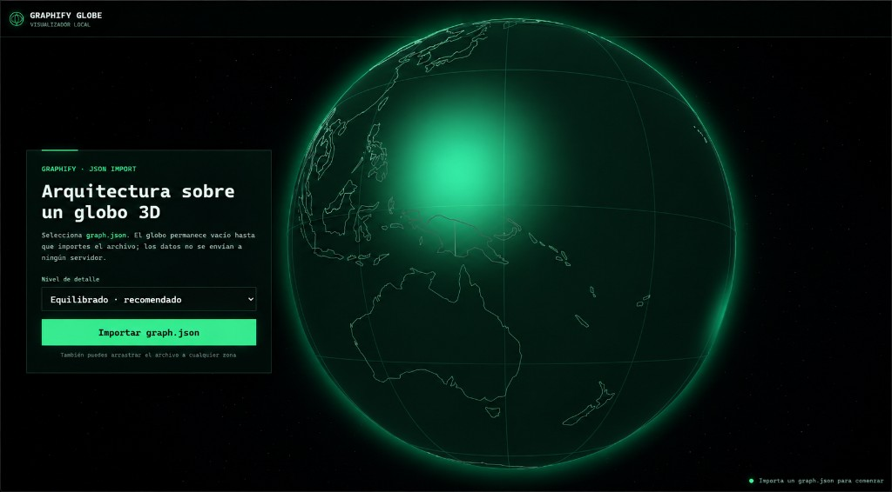

# Graphify Globe React Responsive

Visualizador local de archivos `graph.json` generados por [Graphify](https://github.com/), construido con React, Vite y Three.js.

Compatible con el formato nativo NetworkX (`nodes` + `links`) y con archivos legacy (`edges`, `relationships`, etc.), sin asumir un framework concreto.



## Demo

https://graphify-globe.onrender.com/

> Hosting principal en Render. El sitio en GitHub Pages ya no se publica desde este repositorio.

## Funciones

- Importación local de `graph.json` por selector de archivo o drag and drop.
- En navegadores compatibles, botón para abrir la carpeta `graphify-out` y localizar `graph.json`.
- Detección automática de formato Graphify nativo o legacy.
- Procesamiento en Web Worker: el hilo principal no hace `JSON.parse`.
- Grafo completo separado del subgrafo visible según el nivel de detalle (Ligero / Equilibrado / Detallado).
- Selección equilibrada por comunidad para no monopolizar la vista.
- Filtros dinámicos de **tipo** y **relación** generados desde el contenido real del archivo.
- Buscador en el panel lateral sobre todos los nodos normalizados (no solo los visibles).
- Si buscas un nodo oculto por el límite de calidad, se incluye temporalmente con su vecindario.
- Panel de nodo con comunidad, archivo, ubicación, kind, grado, metadatos y conexiones paginadas.
- Colores de selección por dirección: blanco (seleccionado), magenta (saliente), cian (entrante), amarillo (bidireccional o conectado en grafos no dirigidos).
- Diagnósticos visibles: dangling edges, self-loops, IDs duplicados, hyperedges detectados, etc.
- Interfaz adaptable a escritorio, tablet, móvil y orientación horizontal, con gestos en el panel.

## Formato Graphify

Acepta el `graph.json` oficial similar a:

```json
{
  "directed": false,
  "multigraph": false,
  "graph": {},
  "nodes": [],
  "links": [],
  "hyperedges": []
}
```

También sigue funcionando con esquemas anteriores que usen `edges`, `relationships` u otras colecciones equivalentes.

## Requisitos

- Node.js 20.19 o superior.
- npm 10 o superior.

## Instalación

```powershell
npm install
npm run dev
```

Abre la dirección mostrada por Vite, normalmente:

```text
http://localhost:5173
```

También puedes ejecutar `INICIAR-WINDOWS.bat`.

## Pruebas

```powershell
npm test
```

## Importar el grafo

Selecciona el archivo generado por Graphify:

```text
graphify-out/graph.json
```

No es necesario copiarlo dentro del proyecto ni cambiar la librería Graphify.

## Producción

```powershell
npm run build
npm run preview
```

La compilación se genera en `dist`.
